## Data Introduction
*Dataset exploring state examinations in netherlands as dutch as a second language*
Reference: Schepens, Job, Roeland van Hout, and T. Florian Jaeger. “Big Data Suggest Strong Constraints of Linguistic Similarity on Adult Language Learning.” Cognition 194 (January 1, 2020): 104056. https://doi.org/10.1016/j.cognition.2019.104056.
Data: 
https://www.kaggle.com/datasets/thedevastator/adult-language-learning-profile

Column Name Explanations:  
  
L1: The first language of the learner  
C: The country of birth  
L1L2: The combination of first and best additional language besides Dutch  
AaA: Age at Arrival in the Netherlands in years (starting date of residence)  
LoR: Length of residence in the Netherlands in years  
Edu.day: Duration of daily education (1 low, 2 middle, 3 high, 4 very high)  
Sex: Gender of the participant  
Family: Language family  
ISO639.3: Language ID code according to Ethnologue  
Enroll: Proportion of school-aged youth enrolled in secondary education according to the World Bank for participants country  
Speaking: Speaking proficiency test score on the State Examination of Dutch as a Second Language  
morph: Morphological score related to knowledge structures within words  
lex: Lexicon score indicating understanding of written words  
new_feat: Feature score reflecting ability to acquire new sounds/grammatical structures  
new_sounds: Sound symbols score evaluating pronunciation. (Integer)  

## Who did what?
Imen: Q0 - Data cleaning, Q1-4, 13,14   
Khushleen: Q 5,6,11,12 (and sub-questions)  
Abigail:  Q 7-10  

## 0) Cleaning the data

```r
#Loading the packages
library(tidyverse)
```

```
## ── Attaching packages ─────────────────────────────────────── tidyverse 1.3.2 ──
## ✔ ggplot2 3.4.0     ✔ purrr   1.0.1
## ✔ tibble  3.1.8     ✔ dplyr   1.1.0
## ✔ tidyr   1.2.1     ✔ stringr 1.4.1
## ✔ readr   2.1.3     ✔ forcats 0.5.2
## ── Conflicts ────────────────────────────────────────── tidyverse_conflicts() ──
## ✖ dplyr::filter() masks stats::filter()
## ✖ dplyr::lag()    masks stats::lag()
```

```r
library(tidyr)
library(janitor)
```

```
## 
## Attaching package: 'janitor'
## 
## The following objects are masked from 'package:stats':
## 
##     chisq.test, fisher.test
```

```r
library(naniar)
library(dplyr) 
library(ggthemes)
```


```r
#install.packages("ggthemes")
```


```r
#Load the data
languages <- readr::read_csv("data/stex.csv") 
```

```
## Rows: 50235 Columns: 16
## ── Column specification ────────────────────────────────────────────────────────
## Delimiter: ","
## chr (7): L1, C, L1L2, L2, Sex, Family, ISO639.3
## dbl (9): AaA, LoR, Edu.day, Enroll, Speaking, morph, lex, new_feat, new_sounds
## 
## ℹ Use `spec()` to retrieve the full column specification for this data.
## ℹ Specify the column types or set `show_col_types = FALSE` to quiet this message.
```

```r
# Cleaning Data
languages2<- languages %>% select(-"L1L2") %>% 
  plyr::rename(c("C"="Country", "lex"="Lexicon", "morph"="Morphology","new_feat"="New_Features", "new_sounds"="New_Sounds","Edu.day"="Edu_Days"))
```
 

```r
languages2
```

```
## # A tibble: 50,235 × 15
##    L1      Country L2      AaA   LoR Edu_D…¹ Sex   Family ISO63…² Enroll Speak…³
##    <chr>   <chr>   <chr> <dbl> <dbl>   <dbl> <chr> <chr>  <chr>    <dbl>   <dbl>
##  1 Afrika… SouthA… Engl…    25     0       4 Fema… Indo-… afr         93     496
##  2 Afrika… SouthA… Germ…    47     2       4 Male  Indo-… afr         93     542
##  3 Afrika… SouthA… Mono…    23    23       3 Fema… Indo-… afr         93     585
##  4 Afrika… SouthA… Mono…    42     2       2 Fema… Indo-… afr         93     521
##  5 Afrika… SouthA… Mono…    22    19       3 Fema… Indo-… afr         93     639
##  6 Afrika… SouthA… Mono…    37     2       1 Male  Indo-… afr         93     531
##  7 Afrika… SouthA… Mono…    22     6       4 Fema… Indo-… afr         93     566
##  8 Afrika… Sudan   Engl…    31     3       4 Male  Indo-… afr         31     439
##  9 Afrika… Sudan   Engl…    25     4       4 Male  Indo-… afr         31     480
## 10 Afrika… Afghan… Mono…    23     3       4 Fema… Indo-… afr         19     505
## # … with 50,225 more rows, 4 more variables: Morphology <dbl>, Lexicon <dbl>,
## #   New_Features <dbl>, New_Sounds <dbl>, and abbreviated variable names
## #   ¹​Edu_Days, ²​ISO639.3, ³​Speaking
```

## 1) Where the NAs are:

```r
languages2 %>% 
  summarise_all(~(sum(is.na(.))))
```

```
## # A tibble: 1 × 15
##      L1 Country    L2   AaA   LoR Edu_Days   Sex Family ISO639.3 Enroll Speaking
##   <int>   <int> <int> <int> <int>    <int> <int>  <int>    <int>  <int>    <int>
## 1     0       0     0     0     0        9     0      0        0      0        0
## # … with 4 more variables: Morphology <int>, Lexicon <int>, New_Features <int>,
## #   New_Sounds <int>
```

## 2) Distribution of Sex of Participants

```r
languages2 %>% 
  count(Sex) %>% 
  ggplot(aes(x=Sex,y=n, fill=Sex))+
  geom_col()+
  labs(x="Sex", y="Number of Participants", title = "Representation in the Study by Sex")+
  theme_clean()
```

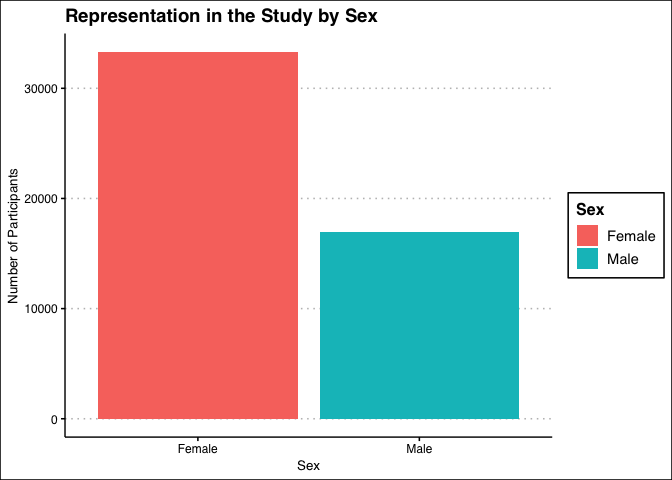<!-- -->

## 3) Distribution of Second Language

```r
languages2 %>% 
  count(L2) %>% 
  ggplot(aes(x=L2,y=n, fill=L2))+
  geom_col()+
  labs(x="L2", y="count", title = "Representation of Second Language in the Study Language")+
  scale_y_log10()+
  coord_flip()+
  guides(fill="none")+
  theme_clean()
```

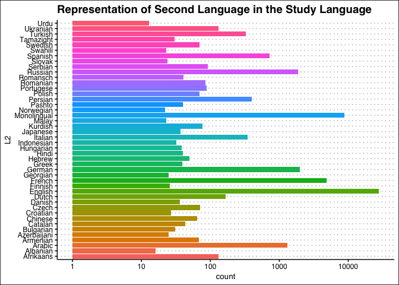<!-- -->


```r
languages2 %>% 
  mutate(AaA=as.factor(AaA))
```

```
## # A tibble: 50,235 × 15
##    L1      Country L2    AaA     LoR Edu_D…¹ Sex   Family ISO63…² Enroll Speak…³
##    <chr>   <chr>   <chr> <fct> <dbl>   <dbl> <chr> <chr>  <chr>    <dbl>   <dbl>
##  1 Afrika… SouthA… Engl… 25        0       4 Fema… Indo-… afr         93     496
##  2 Afrika… SouthA… Germ… 47        2       4 Male  Indo-… afr         93     542
##  3 Afrika… SouthA… Mono… 23       23       3 Fema… Indo-… afr         93     585
##  4 Afrika… SouthA… Mono… 42        2       2 Fema… Indo-… afr         93     521
##  5 Afrika… SouthA… Mono… 22       19       3 Fema… Indo-… afr         93     639
##  6 Afrika… SouthA… Mono… 37        2       1 Male  Indo-… afr         93     531
##  7 Afrika… SouthA… Mono… 22        6       4 Fema… Indo-… afr         93     566
##  8 Afrika… Sudan   Engl… 31        3       4 Male  Indo-… afr         31     439
##  9 Afrika… Sudan   Engl… 25        4       4 Male  Indo-… afr         31     480
## 10 Afrika… Afghan… Mono… 23        3       4 Fema… Indo-… afr         19     505
## # … with 50,225 more rows, 4 more variables: Morphology <dbl>, Lexicon <dbl>,
## #   New_Features <dbl>, New_Sounds <dbl>, and abbreviated variable names
## #   ¹​Edu_Days, ²​ISO639.3, ³​Speaking
```

## 4) Distribution of Age at Arrival

```r
languages2 %>% 
  count(AaA) %>% 
  ggplot(aes(x=AaA,y=n))+
  geom_point()+
  labs(x="Age at Arrival", y="Number of Participants", title = "Representation of Age at Arrival in the Netherlands")+
  scale_y_log10()+
  theme_clean()
```

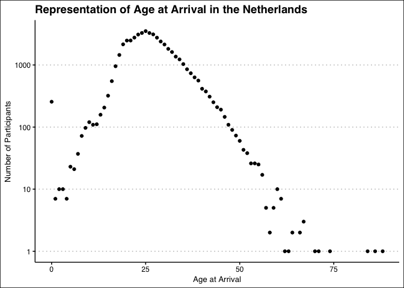<!-- -->

```r
languages2 %>% 
  group_by(AaA) %>% 
  summarise(mean_age_at_arrival=mean(AaA))
```

```
## # A tibble: 73 × 2
##      AaA mean_age_at_arrival
##    <dbl>               <dbl>
##  1     0                   0
##  2     1                   1
##  3     2                   2
##  4     3                   3
##  5     4                   4
##  6     5                   5
##  7     6                   6
##  8     7                   7
##  9     8                   8
## 10     9                   9
## # … with 63 more rows
```

# 5) Comparing speaking proficiency by age at arrival

- There is a general downward trend; as age at arrival increases, proficiency decreases

```r
languages2 %>% 
  group_by(AaA) %>% 
  summarise(Avg_Speaking = mean(Speaking)) %>% 
  ggplot(aes(x=AaA, y=Avg_Speaking))+
  geom_point(shape=2)+
  geom_smooth(method = lm)+
  labs(title = "Speaking Scores By Participants Age at Arrival in Netherlands", x = "Age of Participants", y="Average Speaking Score" )+
  guides(fill="none")+
  theme_clean()
```

```
## `geom_smooth()` using formula = 'y ~ x'
```

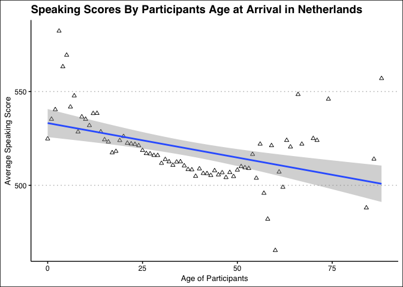<!-- -->

# 6) Comparing Length of Education and Speaking Proficiency

```r
languages2 %>% 
  mutate(Edu_Days_Category = case_when(Edu_Days == 1 ~ "low",
                   Edu_Days == 2 ~ "middle",
                   Edu_Days == 3 ~ "high",
                   Edu_Days == 4 ~ "very high")) %>% 
  filter(!is.na(Edu_Days_Category)) %>% 
  ggplot(aes(x=Speaking, fill=Edu_Days_Category))+
  geom_histogram(bins = 40, alpha=0.6)+
  facet_wrap(.~Edu_Days_Category)+
  labs(title = "Speaking Scores By Days of Formal Education", x = "Speaking Score", y="Number of Participants")+
  guides(fill="none")+
  theme_clean()
```

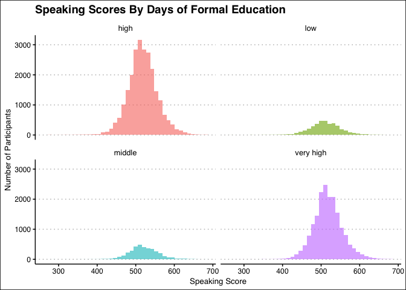<!-- -->

- By gender

```r
languages2 %>% 
  mutate(Edu_Days_Category = case_when(Edu_Days == 1 ~ "low",
                   Edu_Days == 2 ~ "middle",
                   Edu_Days == 3 ~ "high",
                   Edu_Days == 4 ~ "very high")) %>% 
  filter(!is.na(Edu_Days_Category)) %>% 
  ggplot(aes(x=Speaking, fill=Sex))+
  geom_histogram(bins = 40, alpha = 0.6)+
  facet_grid(Sex~Edu_Days_Category, scales = "free_y")+
  labs(title = "Speaking Scores By Days of Formal Education and Sex", y = "Speaking Score" , x=NULL)+
  guides(fill="none")+
  theme_clean()
```

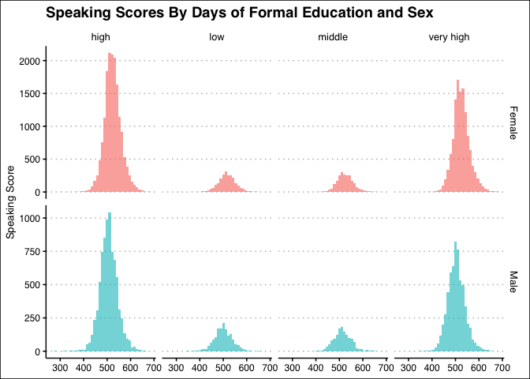<!-- -->

## 7) Exploring Language Distribution (L1) w/ Country


```r
languages2 %>% 
  group_by(Country) %>% 
  select(L1) %>% 
  summarize(n_languages=n_distinct(L1)) %>%  
  arrange(-n_languages) #for top 5 countries that speak the most amount of different L1
```

```
## Adding missing grouping variables: `Country`
```

```
## # A tibble: 119 × 2
##    Country       n_languages
##    <chr>               <int>
##  1 Netherlands            32
##  2 USSR                   30
##  3 Germany                29
##  4 Yugoslavia             27
##  5 Iran                   19
##  6 UnitedKingdom          19
##  7 Russia                 17
##  8 Turkey                 17
##  9 UnitedStates           16
## 10 Morocco                15
## # … with 109 more rows
```


```r
netherlands_languages <- languages2 %>% 
  select(L1, L2, Country) %>% 
  filter(Country == "Netherlands")
netherlands_languages
```

```
## # A tibble: 735 × 3
##    L1        L2          Country    
##    <chr>     <chr>       <chr>      
##  1 Afrikaans English     Netherlands
##  2 Afrikaans English     Netherlands
##  3 Arabic    French      Netherlands
##  4 Arabic    French      Netherlands
##  5 Arabic    English     Netherlands
##  6 Arabic    French      Netherlands
##  7 Arabic    Monolingual Netherlands
##  8 Arabic    English     Netherlands
##  9 Arabic    French      Netherlands
## 10 Arabic    French      Netherlands
## # … with 725 more rows
```


```r
p <- netherlands_languages %>% 
  select(L1) %>% 
  group_by(L1) %>% 
  summarize(n=n()) %>% 
  arrange(-n) %>% 
  head(n=10)
p
```

```
## # A tibble: 10 × 2
##    L1             n
##    <chr>      <int>
##  1 Turkish      281
##  2 Arabic       185
##  3 English       69
##  4 French        28
##  5 German        26
##  6 Spanish       19
##  7 Italian       17
##  8 Portugese     17
##  9 Tamazight     17
## 10 Indonesian    14
```


```r
p %>% 
  ggplot(aes(x=reorder(L1, n), y=n, fill=L1))+
  geom_col(na.rm = T, alpha=0.6)+ 
  labs(title = "Most Common First Languages (L1) of People Born in the Netherlands",
       x = "Language",
       y = "Count of Residents That Speak L1") +
  theme_clean()+
  guides(fill="none")
```

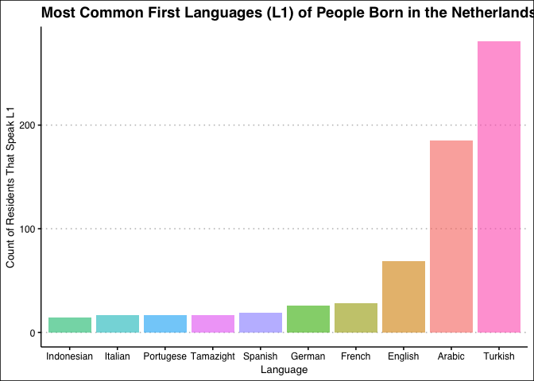<!-- -->


## 8) Top 10 L2 in Netherlands


```r
netherlands_languages %>% 
  select(L2) %>% 
  group_by(L2) %>% 
  summarize(n=n()) %>% 
  arrange(-n) #when exploring top 10 L2, find that 223 residents are monolingual
```

```
## # A tibble: 18 × 2
##    L2              n
##    <chr>       <int>
##  1 English       294
##  2 Monolingual   223
##  3 French        150
##  4 Arabic         18
##  5 German         17
##  6 Spanish        10
##  7 Turkish         5
##  8 Dutch           4
##  9 Afrikaans       3
## 10 Italian         2
## 11 Portugese       2
## 12 Catalan         1
## 13 Greek           1
## 14 Hindi           1
## 15 Russian         1
## 16 Swedish         1
## 17 Tamazight       1
## 18 Ukranian        1
```


```r
p2 <- netherlands_languages %>% 
  select(L2) %>% 
  filter(L2!="Monolingual") %>% 
  group_by(L2) %>% 
  summarize(n_L2=n()) %>% 
  arrange(-n_L2) %>% 
  head(n=10)
p2
```

```
## # A tibble: 10 × 2
##    L2         n_L2
##    <chr>     <int>
##  1 English     294
##  2 French      150
##  3 Arabic       18
##  4 German       17
##  5 Spanish      10
##  6 Turkish       5
##  7 Dutch         4
##  8 Afrikaans     3
##  9 Italian       2
## 10 Portugese     2
```


```r
netherlands_languages %>% 
  group_by(Country) %>% 
  summarize(across(c(L1, L2), n_distinct))
```

```
## # A tibble: 1 × 3
##   Country        L1    L2
##   <chr>       <int> <int>
## 1 Netherlands    32    18
```


```r
p2 %>% 
  ggplot(aes(x=reorder(L2, n_L2), y=n_L2, fill=L2))+
  geom_col(na.rm = T, alpha=0.6)+ 
  labs(title = "10 Best Additional Languages (L2) of People Born in the Netherlands",
       x = "Language",
       y = "Count of Residents That Speak L2") +
  theme_clean()+
  guides(fill="none")
```

<!-- -->

## 9) Morphology & L1 vs Proficiency


```r
p4 <- languages2 %>% 
  group_by(Country) %>% 
  filter(Country=="USSR") %>% 
  select(Country, L1, Speaking, Morphology) %>% 
  filter(!is.na(Morphology)) %>% 
  filter(Speaking>="600") %>% 
  arrange(-Speaking)
```


```r
p4 %>% 
  ggplot(aes(x=Morphology, y=Speaking))+
  geom_point()+
  facet_grid(.~L1)+
  labs(title = "USSR Proficiency Score vs. Morphological Similarities & L1",
       x= "Score of Morphological Simiarities",
       y= "Proficiency Score")+
  theme_clean()+
  theme(axis.text.x = element_text(angle = 60, hjust = 1))
```

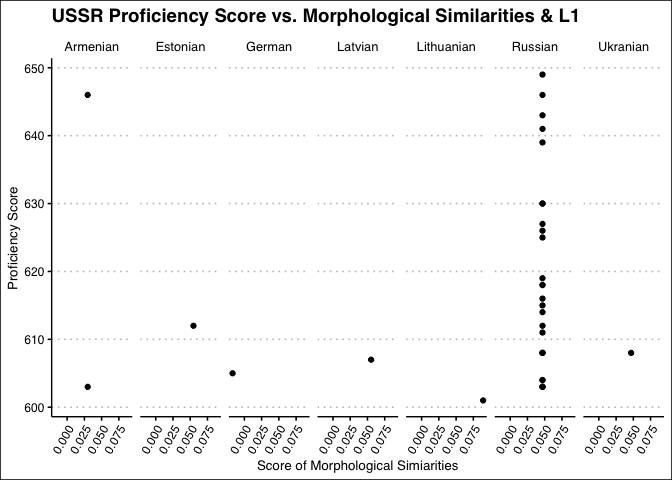<!-- -->

## 10) Speaking prof vs. Country & Education Time?
Based off of the top 3 countries that speak the most different amt of L1
Extremes of edu.days (low & very high)


```r
p3 <- languages2 %>% 
  group_by(Country) %>% 
  filter(Country=="Netherlands" | 
         Country=="USSR" |
         Country=="Germany") %>% 
  select(Country, Speaking, Edu_Days) %>% 
  mutate(Edu_Days_Category = case_when(Edu_Days == 1 ~ "low",
                   Edu_Days == 2 ~ "middle",
                   Edu_Days == 3 ~ "high",
                   Edu_Days == 4 ~ "very high")) %>% 
  filter(Edu_Days_Category=="very high" |
           Edu_Days_Category=="low")
p3
```

```
## # A tibble: 3,025 × 4
## # Groups:   Country [3]
##    Country     Speaking Edu_Days Edu_Days_Category
##    <chr>          <dbl>    <dbl> <chr>            
##  1 Netherlands      640        4 very high        
##  2 Netherlands      556        4 very high        
##  3 USSR             497        1 low              
##  4 Netherlands      533        4 very high        
##  5 Germany          546        4 very high        
##  6 USSR             494        4 very high        
##  7 Netherlands      547        4 very high        
##  8 Germany          579        4 very high        
##  9 Netherlands      534        1 low              
## 10 Netherlands      495        1 low              
## # … with 3,015 more rows
```


```r
p3 %>% 
  ggplot(aes(x=Speaking))+
  geom_density()+
  facet_grid(Country~Edu_Days_Category)+
  theme_clean()+
  labs(title = "Proficiency Score vs. Country & Daily Education Duration",
       x = "Proficiency Score")
```

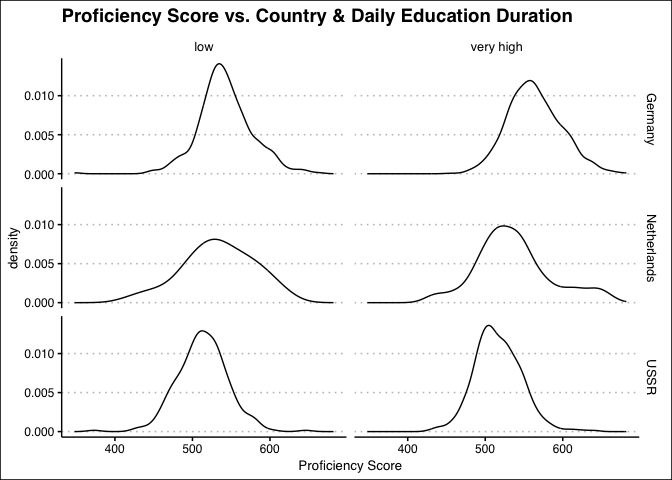<!-- -->

## 11) LoR vs Speaking Proficiency

- Looking at number of participants per residency length category

```r
languages2 %>% 
  mutate(LoR_Category = case_when(LoR <= 15 ~ "low",
                  LoR > 15 & LoR <= 30 ~ "middle",
                  LoR > 30 & LoR <= 45 ~ "high",
                  LoR > 45 ~ "very high")) %>% 
  count(LoR_Category) %>% 
  ggplot(aes(x=LoR_Category, y=n, fill=LoR_Category))+
  geom_col(alpha = 0.6)+
  labs(title = "Participants Per Residency Category", x= "Length of Residency", y = "Number of Participants")+
  guides(fill="none")+
  theme_clean()
```

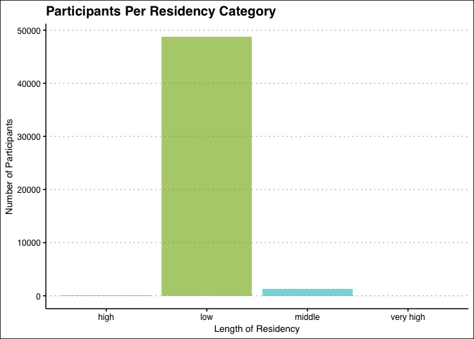<!-- -->

- Looking at spread of speaking score for LoR category with most participants (low)

```r
languages2 %>% 
  mutate(LoR_Category = case_when(LoR <= 15 ~ "low",
                  LoR > 15 & LoR <= 30 ~ "middle",
                  LoR > 30 & LoR <= 45 ~ "high",
                  LoR > 45 ~ "very high")) %>% 
  filter(LoR_Category == "low") %>% 
  ggplot(aes(x=Speaking))+
  geom_histogram()+
  labs(title = "Speaking Score Distribution for Low Residency Category", x= "Speaking Score", y = "Number of Participants")+
  guides(fill="none")+
  theme_clean()
```

```
## `stat_bin()` using `bins = 30`. Pick better value with `binwidth`.
```

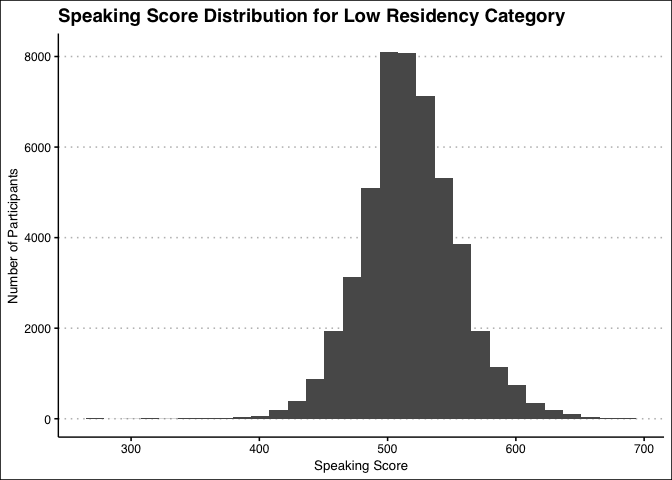<!-- -->

- Looking at spread of the other residency categories

```r
languages2 %>% 
  mutate(LoR_Category = case_when(LoR <= 15 ~ "low",
                  LoR > 15 & LoR <= 30 ~ "middle",
                  LoR > 30 & LoR <= 45 ~ "high",
                  LoR > 45 ~ "very high")) %>% 
  filter(LoR_Category != "low") %>% 
  ggplot(aes(x=Speaking, fill=LoR_Category))+
  geom_histogram(alpha=0.6, bins=60)+
  facet_wrap(.~LoR_Category)+
  labs(title = "Speaking Scores per Residency Category", x= "Speaking Score", y = "Number of Participants")+
  guides(fill="none")+
  theme_clean()
```

<!-- -->

## 12) Comparision of new sounds learned vs language family

- average new sounds per language family

```r
languages2 %>% 
  filter(!is.na(New_Sounds)) %>% 
  group_by(Family) %>% 
  summarise(avg_new_sounds = mean(New_Sounds, na.rm = T)) %>% 
  ggplot(aes(x=reorder(Family, -avg_new_sounds) , y=avg_new_sounds, fill=Family))+
  geom_col(alpha = 0.6)+
  labs(title = "Average New Sounds Learned By Language Family", x= "Language Family", y = "Average Number Of New Sounds")+
  guides(fill="none")+
  theme_clean()+
  theme(axis.text.x = element_text(angle = 25, hjust = 0.6))
```

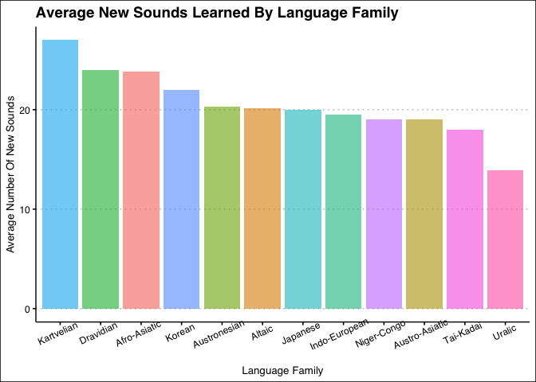<!-- -->

- exploring speaking proficiency scores by language family for least and most new sounds, using relative frequency of scores

```r
languages2 %>% 
  filter(Family == "Kartvelian" | Family == "Uralic") %>% 
  ggplot(aes(x=Speaking))+
  geom_histogram(bins = 40, aes(y=after_stat(density), fill=Family), alpha=0.6)+
  facet_wrap(.~Family)+
  labs(title = "Speaking Scores for Family With Least And Most New Sounds", y = "Relative Frequency Of New Sounds")+
  guides(fill="none")+
  theme_clean()
```

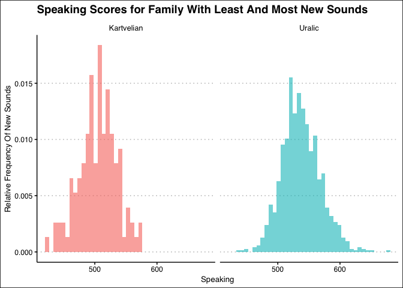<!-- -->

## 13) From what countries do people learn Dutch the easiest? (What country has the highest lexicon?)

```r
#Highest Lexile(best understanding of new written words on avg):
languages2 %>% 
  group_by(Country) %>% 
  summarise(mean_lexile=mean(Lexicon), na.rm=T) %>% 
  arrange(desc(mean_lexile)) %>% slice_head()
```

```
## # A tibble: 1 × 3
##   Country mean_lexile na.rm
##   <chr>         <dbl> <lgl>
## 1 Somalia       0.594 TRUE
```

```r
#Highest Morphology(best knowledge of word structure on avg):
languages2 %>% 
  group_by(Country) %>% 
  summarise(mean_morph=mean(Morphology), na.rm=T) %>% 
  arrange(desc(mean_morph)) %>% slice_head() 
```

```
## # A tibble: 1 × 3
##   Country mean_morph na.rm
##   <chr>        <dbl> <lgl>
## 1 Vietnam      0.282 TRUE
```

```r
#Highest Proficiency(best speaking scores on avg):
languages2 %>% 
  group_by(Country) %>% 
  summarise(mean_speaking=mean(Speaking)) %>% 
  arrange(desc(mean_speaking))%>% slice_head()
```

```
## # A tibble: 1 × 2
##   Country mean_speaking
##   <chr>           <dbl>
## 1 Austria          564.
```

## 14) Do men or women tend to have an easier time learning Dutch on average?

```r
languages2 %>%
  filter(Sex=="Female") %>% 
  summarise(mean_speaking=mean(Speaking), mean_morph=mean(Morphology, na.rm=T), mean_lexile=mean(Lexicon), mean_features=mean(New_Features, na.rm = T))
```

```
## # A tibble: 1 × 4
##   mean_speaking mean_morph mean_lexile mean_features
##           <dbl>      <dbl>       <dbl>         <dbl>
## 1          524.     0.0488       0.384          13.8
```

```r
languages2 %>%
  filter(Sex=="Male") %>% 
  summarise(mean_speaking=mean(Speaking), mean_morph=mean(Morphology, na.rm=T), mean_lexile=mean(Lexicon), mean_features=mean(New_Features, na.rm = T))
```

```
## # A tibble: 1 × 4
##   mean_speaking mean_morph mean_lexile mean_features
##           <dbl>      <dbl>       <dbl>         <dbl>
## 1          505.     0.0529       0.465          15.7
```


