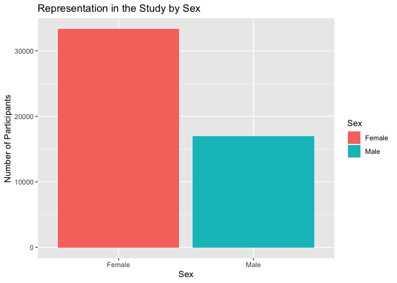
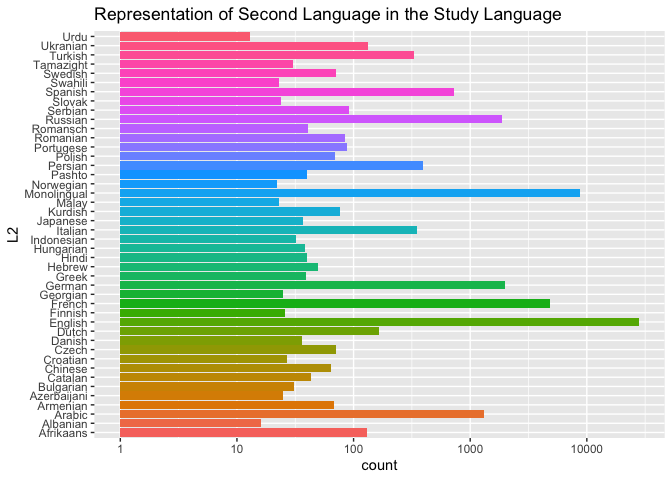
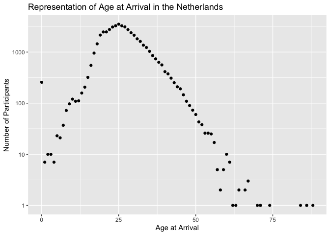
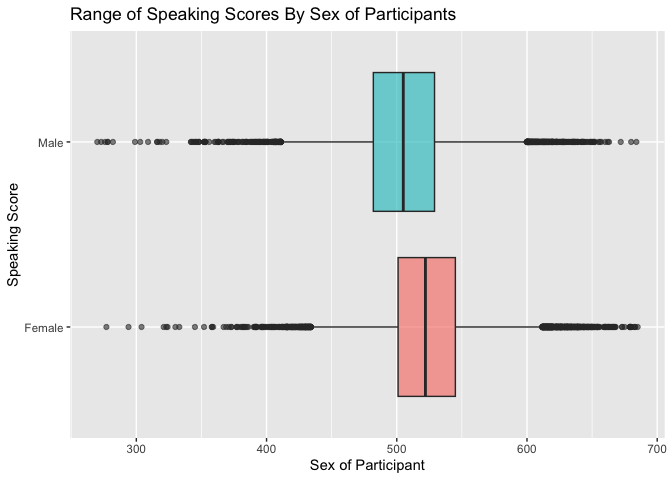
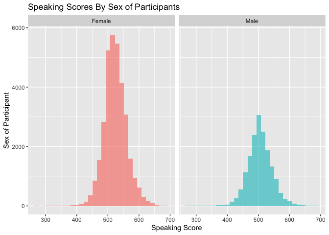
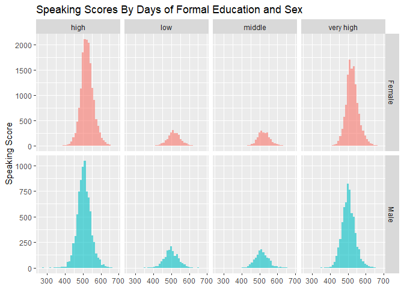
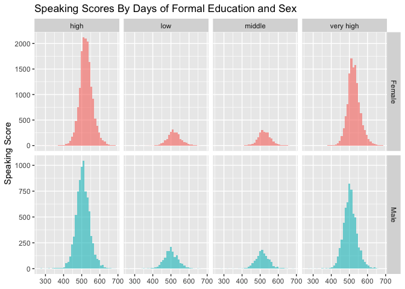
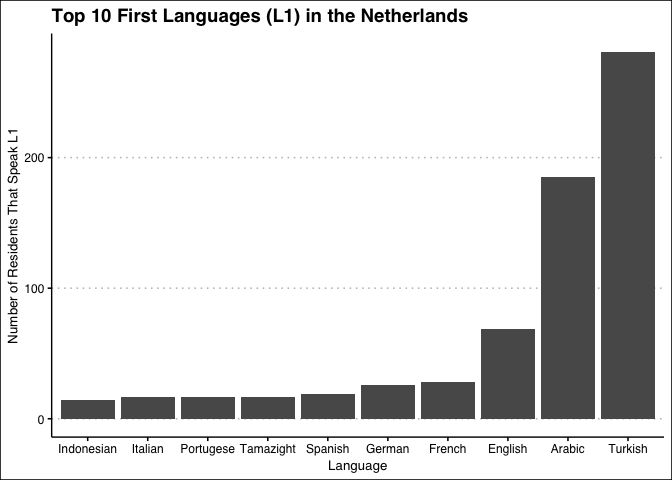

## Data Introduction
*Dataset exploring state examinations in netherlands as dutch as a second language*
Reference: Schepens, Job, Roeland van Hout, and T. Florian Jaeger. “Big Data Suggest Strong Constraints of Linguistic Similarity on Adult Language Learning.” Cognition 194 (January 1, 2020): 104056. https://doi.org/10.1016/j.cognition.2019.104056.
Data: 
https://www.kaggle.com/datasets/thedevastator/adult-language-learning-profile

##Column Name Explanations
L1: The first language of the learner
C: The country of birth
L1L2: The combination of first and best additional language besides Dutch
AaA: Age at Arrival in the Netherlands in years (starting date of residence)
LoR: Length of residence in the Netherlands in years
Edu.day: Duration of daily education (1 low, 2 middle, 3 high, 4 very high)
Sex: Gender of the participant
Family: Language family
ISO639.3: Language ID code according to Ethnologue
Enroll: Proportion of school-aged youth enrolled in secondary education according to the World Bank for participants country
Speaking: Speaking proficiency test score on the State Examination of Dutch as a Second Language
morph: Morphological score related to knowledge structures within words
lex: Lexicon score indicating understanding of written words
new_feat: Feature score reflecting ability to acquire new sounds/grammatical structures. (Integer)
new_sounds: Sound symbols score evaluating pronunciation. (Integer)


```r
library(tidyverse)
```

```
## ── Attaching packages ─────────────────────────────────────── tidyverse 1.3.2 ──
## ✔ ggplot2 3.4.0     ✔ purrr   1.0.1
## ✔ tibble  3.1.8     ✔ dplyr   1.1.0
## ✔ tidyr   1.2.1     ✔ stringr 1.4.1
## ✔ readr   2.1.3     ✔ forcats 0.5.2
## ── Conflicts ────────────────────────────────────────── tidyverse_conflicts() ──
## ✖ dplyr::filter() masks stats::filter()
## ✖ dplyr::lag()    masks stats::lag()
```

```r
library(tidyr)
library(janitor)
```

```
## 
## Attaching package: 'janitor'
## 
## The following objects are masked from 'package:stats':
## 
##     chisq.test, fisher.test
```

```r
library(naniar)
library(dplyr) 
library(ggthemes)
```


```r
#install.packages("ggthemes")
```


```r
languages <- readr::read_csv("stex.csv") 
```

```
## Rows: 50235 Columns: 16
## ── Column specification ────────────────────────────────────────────────────────
## Delimiter: ","
## chr (7): L1, C, L1L2, L2, Sex, Family, ISO639.3
## dbl (9): AaA, LoR, Edu.day, Enroll, Speaking, morph, lex, new_feat, new_sounds
## 
## ℹ Use `spec()` to retrieve the full column specification for this data.
## ℹ Specify the column types or set `show_col_types = FALSE` to quiet this message.
```

```r
languages2<- languages %>% select(-"L1L2") %>% 
  plyr::rename(c("C"="Country", "lex"="Lexicon", "morph"="Morphology","new_feat"="New_Features", "new_sounds"="New_Sounds","Edu.day"="Edu_Days"))
```
 

```r
languages2
```

```
## # A tibble: 50,235 × 15
##    L1      Country L2      AaA   LoR Edu_D…¹ Sex   Family ISO63…² Enroll Speak…³
##    <chr>   <chr>   <chr> <dbl> <dbl>   <dbl> <chr> <chr>  <chr>    <dbl>   <dbl>
##  1 Afrika… SouthA… Engl…    25     0       4 Fema… Indo-… afr         93     496
##  2 Afrika… SouthA… Germ…    47     2       4 Male  Indo-… afr         93     542
##  3 Afrika… SouthA… Mono…    23    23       3 Fema… Indo-… afr         93     585
##  4 Afrika… SouthA… Mono…    42     2       2 Fema… Indo-… afr         93     521
##  5 Afrika… SouthA… Mono…    22    19       3 Fema… Indo-… afr         93     639
##  6 Afrika… SouthA… Mono…    37     2       1 Male  Indo-… afr         93     531
##  7 Afrika… SouthA… Mono…    22     6       4 Fema… Indo-… afr         93     566
##  8 Afrika… Sudan   Engl…    31     3       4 Male  Indo-… afr         31     439
##  9 Afrika… Sudan   Engl…    25     4       4 Male  Indo-… afr         31     480
## 10 Afrika… Afghan… Mono…    23     3       4 Fema… Indo-… afr         19     505
## # … with 50,225 more rows, 4 more variables: Morphology <dbl>, Lexicon <dbl>,
## #   New_Features <dbl>, New_Sounds <dbl>, and abbreviated variable names
## #   ¹​Edu_Days, ²​ISO639.3, ³​Speaking
```

##Where the NAs are:

```r
languages2 %>% 
  summarise_all(~(sum(is.na(.))))
```

```
## # A tibble: 1 × 15
##      L1 Country    L2   AaA   LoR Edu_Days   Sex Family ISO639.3 Enroll Speaking
##   <int>   <int> <int> <int> <int>    <int> <int>  <int>    <int>  <int>    <int>
## 1     0       0     0     0     0        9     0      0        0      0        0
## # … with 4 more variables: Morphology <int>, Lexicon <int>, New_Features <int>,
## #   New_Sounds <int>
```

##Distribution of Sex of Participants

```r
languages2 %>% 
  count(Sex) %>% 
  ggplot(aes(x=Sex,y=n, fill=Sex))+
  geom_col()+
  labs(x="Sex", y="Number of Participants", title = "Representation in the Study by Sex")#+
```

<!-- -->

```r
  #geom_text(aes(label=freq),vjust = -0.5)
```

##Distribution of Second Language

```r
languages2 %>% 
  count(L2) %>% 
  ggplot(aes(x=L2,y=n, fill=L2))+
  geom_col()+
  labs(x="L2", y="count", title = "Representation of Second Language in the Study Language")+
  scale_y_log10()+
  coord_flip()+
  guides(fill="none")#+
```

<!-- -->

```r
  #geom_text(aes(label=freq))
```


```r
languages2 %>% 
  mutate(AaA=as.factor(AaA))
```

```
## # A tibble: 50,235 × 15
##    L1      Country L2    AaA     LoR Edu_D…¹ Sex   Family ISO63…² Enroll Speak…³
##    <chr>   <chr>   <chr> <fct> <dbl>   <dbl> <chr> <chr>  <chr>    <dbl>   <dbl>
##  1 Afrika… SouthA… Engl… 25        0       4 Fema… Indo-… afr         93     496
##  2 Afrika… SouthA… Germ… 47        2       4 Male  Indo-… afr         93     542
##  3 Afrika… SouthA… Mono… 23       23       3 Fema… Indo-… afr         93     585
##  4 Afrika… SouthA… Mono… 42        2       2 Fema… Indo-… afr         93     521
##  5 Afrika… SouthA… Mono… 22       19       3 Fema… Indo-… afr         93     639
##  6 Afrika… SouthA… Mono… 37        2       1 Male  Indo-… afr         93     531
##  7 Afrika… SouthA… Mono… 22        6       4 Fema… Indo-… afr         93     566
##  8 Afrika… Sudan   Engl… 31        3       4 Male  Indo-… afr         31     439
##  9 Afrika… Sudan   Engl… 25        4       4 Male  Indo-… afr         31     480
## 10 Afrika… Afghan… Mono… 23        3       4 Fema… Indo-… afr         19     505
## # … with 50,225 more rows, 4 more variables: Morphology <dbl>, Lexicon <dbl>,
## #   New_Features <dbl>, New_Sounds <dbl>, and abbreviated variable names
## #   ¹​Edu_Days, ²​ISO639.3, ³​Speaking
```

##Distribution of Age at Arrival

```r
languages2 %>% 
  count(AaA) %>% 
  ggplot(aes(x=AaA,y=n))+
  geom_point()+
  labs(x="Age at Arrival", y="Number of Participants", title = "Representation of Age at Arrival in the Netherlands")+
  scale_y_log10()
```

<!-- -->

```r
languages2 %>% 
  group_by(AaA) %>% 
  summarise(mean_age_at_arrival=mean(AaA))
```

```
## # A tibble: 73 × 2
##      AaA mean_age_at_arrival
##    <dbl>               <dbl>
##  1     0                   0
##  2     1                   1
##  3     2                   2
##  4     3                   3
##  5     4                   4
##  6     5                   5
##  7     6                   6
##  8     7                   7
##  9     8                   8
## 10     9                   9
## # … with 63 more rows
```
#Comparing speaking proficiency by age
- Looking at the distribution

```r
languages2 %>% 
  ggplot(aes(x=Sex, y=Speaking, fill=Sex))+
  geom_boxplot(alpha=0.6)+
  coord_flip()+
  labs(title = "Range of Speaking Scores By Sex of Participants", x = "Speaking Score", y="Sex of Participant" )+
  guides(fill="none")
```

<!-- -->

```r
languages2 %>% 
  ggplot(aes(x=Speaking, fill=Sex))+
  geom_histogram(alpha=0.6)+
  facet_wrap(.~Sex)+
  labs(title = "Speaking Scores By Sex of Participants", x = "Speaking Score", y="Sex of Participant" )+
  guides(fill="none")
```

```
## `stat_bin()` using `bins = 30`. Pick better value with `binwidth`.
```

<!-- -->
#Comparing Length of Education and Speaking Proficiency

```r
languages2 %>% 
  mutate(Edu_Days_Category = case_when(Edu_Days == 1 ~ "low",
                   Edu_Days == 2 ~ "middle",
                   Edu_Days == 3 ~ "high",
                   Edu_Days == 4 ~ "very high")) %>% 
  filter(!is.na(Edu_Days_Category)) %>% 
  ggplot(aes(x=Speaking, fill=Edu_Days_Category))+
  geom_histogram(bins = 40, alpha=0.6)+
  facet_wrap(.~Edu_Days_Category)+
  labs(title = "Speaking Scores By Days of Formal Education", y = "Speaking Score", x=NULL )+
  guides(fill="none")
```

<!-- -->
- By gender

```r
languages2 %>% 
  mutate(Edu_Days_Category = case_when(Edu_Days == 1 ~ "low",
                   Edu_Days == 2 ~ "middle",
                   Edu_Days == 3 ~ "high",
                   Edu_Days == 4 ~ "very high")) %>% 
  filter(!is.na(Edu_Days_Category)) %>% 
  ggplot(aes(x=Speaking, fill=Sex))+
  geom_histogram(bins = 40, alpha = 0.6)+
  facet_grid(Sex~Edu_Days_Category, scales = "free_y")+
  labs(title = "Speaking Scores By Days of Formal Education and Sex", y = "Speaking Score" , x=NULL)+
  guides(fill="none")
```

<!-- -->

#Exploring Language Distribution (L1) w/ Country


```r
languages2 %>% 
  group_by(Country) %>% 
  select(L1) %>% 
  summarize(n_languages=n_distinct(L1)) %>%  
  arrange(-n_languages) #for top 5 countries that speak the most amount of different L1
```

```
## Adding missing grouping variables: `Country`
```

```
## # A tibble: 119 × 2
##    Country       n_languages
##    <chr>               <int>
##  1 Netherlands            32
##  2 USSR                   30
##  3 Germany                29
##  4 Yugoslavia             27
##  5 Iran                   19
##  6 UnitedKingdom          19
##  7 Russia                 17
##  8 Turkey                 17
##  9 UnitedStates           16
## 10 Morocco                15
## # … with 109 more rows
```


```r
netherlands_languages <- languages2 %>% 
  select(L1, L2, Country) %>% 
  filter(Country == "Netherlands")
netherlands_languages
```

```
## # A tibble: 735 × 3
##    L1        L2          Country    
##    <chr>     <chr>       <chr>      
##  1 Afrikaans English     Netherlands
##  2 Afrikaans English     Netherlands
##  3 Arabic    French      Netherlands
##  4 Arabic    French      Netherlands
##  5 Arabic    English     Netherlands
##  6 Arabic    French      Netherlands
##  7 Arabic    Monolingual Netherlands
##  8 Arabic    English     Netherlands
##  9 Arabic    French      Netherlands
## 10 Arabic    French      Netherlands
## # … with 725 more rows
```


```r
p <- netherlands_languages %>% 
  select(L1) %>% 
  group_by(L1) %>% 
  summarize(n=n()) %>% 
  arrange(-n) %>% 
  head(n=10)
p
```

```
## # A tibble: 10 × 2
##    L1             n
##    <chr>      <int>
##  1 Turkish      281
##  2 Arabic       185
##  3 English       69
##  4 French        28
##  5 German        26
##  6 Spanish       19
##  7 Italian       17
##  8 Portugese     17
##  9 Tamazight     17
## 10 Indonesian    14
```


```r
p %>% 
  ggplot(aes(x=reorder(L1, n), y=n))+
  geom_col(na.rm = T)+ 
  labs(title = "Top 10 First Languages (L1) in the Netherlands",
       x = "Language",
       y = "Number of Residents That Speak L1") +
  theme_clean()
```

<!-- -->

